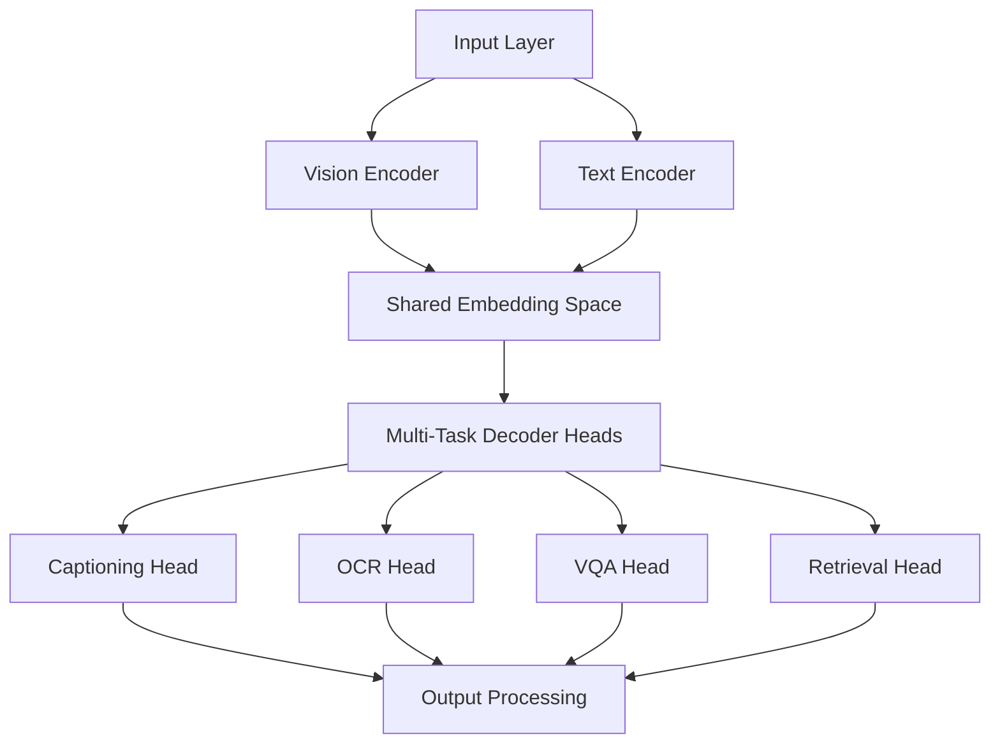

# Architecture Overview

## Mobile Multi-Modal LLM Architecture

This document outlines the system architecture for the Mobile Multi-Modal LLM project - a sub-35MB vision-text transformer optimized for on-device inference on Android and iOS platforms.

## System Overview


```mermaid
graph TB
    A[Input Layer] --> B[Vision Encoder]
    A --> C[Text Encoder]
    B --> D[Shared Embedding Space]
    C --> D
    D --> E[Multi-Task Decoder Heads]
    E --> F[Captioning Head]
    E --> G[OCR Head]
    E --> H[VQA Head]
    E --> I[Retrieval Head]
    F --> J[Output Processing]
    G --> J
    H --> J
    I --> J
```

## Core Components

### 1. Vision Encoder
- **Input**: 224x224 RGB images
- **Architecture**: Custom mobile-optimized transformer with attention mechanisms
- **Quantization**: INT2 quantization for Qualcomm Hexagon NPU
- **Key Features**:
  - Dynamic patch tokenization
  - Hardware-aware attention patterns
  - Optimized for mobile memory constraints

### 2. Text Encoder (Optional)
- **Input**: Tokenized text sequences (max 128 tokens)
- **Architecture**: Lightweight BERT-like encoder
- **Shared Vocabulary**: Unified token space with vision encoder
- **Optimization**: Pruned attention heads for mobile efficiency

### 3. Multi-Task Decoder Heads
- **Captioning Head**: Autoregressive text generation
- **OCR Head**: Text region detection + recognition
- **VQA Head**: Question-answer matching
- **Retrieval Head**: Image-text embedding alignment

### 4. Quantization Pipeline
- **Target**: Qualcomm Hexagon NPU INT2 operations
- **Calibration**: 1000 diverse samples from COCO/TextOCR
- **Accuracy Preservation**: <2% degradation vs FP32
- **Model Size**: <35MB total

## Data Flow

### Inference Pipeline
1. **Input Processing**:
   - Image: Resize → Normalize → Tensor conversion
   - Text (optional): Tokenize → Encode → Embed

2. **Feature Extraction**:
   - Vision features through mobile-optimized encoder
   - Text features (if applicable) through lightweight encoder
   - Fusion in shared embedding space

3. **Task-Specific Processing**:
   - Route through appropriate decoder head
   - Apply task-specific post-processing
   - Format output for mobile app consumption

4. **Hardware Optimization**:
   - Qualcomm Hexagon NPU acceleration
   - iOS Neural Engine utilization
   - Fallback to CPU/GPU when needed

## Mobile Platform Integration

### Android Architecture
```
Application Layer
├── Kotlin/Java Interface
├── JNI Bridge
└── Native C++ Layer
    ├── TensorFlow Lite Runtime
    ├── Hexagon SDK Integration
    └── Model Loading/Inference
```

### iOS Architecture
```
Application Layer
├── Swift Interface
├── Core ML Framework
└── Neural Engine Integration
    ├── Model Package (.mlpackage)
    ├── Prediction Pipeline
    └── Memory Management
```

## Performance Characteristics

### Latency Targets
- **Snapdragon 8 Gen 3**: <12ms per inference
- **Snapdragon 7 Gen 1**: <25ms per inference
- **Apple A17 Pro**: <10ms per inference
- **Apple A15**: <20ms per inference

### Memory Usage
- **Model Size**: 34MB (INT2 quantized)
- **Runtime Memory**: <150MB peak
- **Activation Memory**: <50MB per inference

### Accuracy Benchmarks
- **Image Captioning (CIDEr)**: 94.7
- **OCR Accuracy**: 93.1%
- **VQA Score**: 73.9
- **Retrieval mAP@10**: 89.2%

## Security & Privacy

### On-Device Processing
- **No Network Dependency**: Complete inference on-device
- **Data Privacy**: No user data leaves the device
- **Model Security**: Encrypted model artifacts

### Integrity Verification
- **Model Checksums**: SHA-256 validation
- **Code Signing**: Platform-native signing
- **Runtime Verification**: Input/output validation

## Scalability Considerations

### Model Variants
- **Nano**: 15MB, reduced accuracy for ultra-low-end devices
- **Standard**: 34MB, balanced performance/accuracy
- **Pro**: 60MB, maximum accuracy for high-end devices

### Task Extensions
- **Modular Design**: Easy addition of new decoder heads
- **Transfer Learning**: Fine-tuning on custom datasets
- **Hardware Adaptation**: Automatic optimization for new chipsets

## Technology Stack

### Core Dependencies
- **Training**: PyTorch 2.3+, Transformers 4.40+
- **Quantization**: Neural Compressor, QTI SNPE SDK
- **Mobile Runtime**: TensorFlow Lite, Core ML, ONNX Runtime

### Development Tools
- **Mobile SDKs**: Android NDK r25+, Xcode 15+
- **Hardware SDKs**: Qualcomm Hexagon SDK 5.5+
- **Testing**: Pytest, Android Instrumentation, XCTest

## Deployment Architecture

### Model Distribution
- **GitHub Releases**: Versioned model artifacts
- **CDN Distribution**: Global model delivery
- **OTA Updates**: Incremental model updates

### Mobile App Integration
- **Bundle Size**: Models included in app package
- **Dynamic Loading**: Optional runtime model download
- **Caching Strategy**: Local model persistence

## Future Roadmap

### Hardware Support
- **MediaTek APU**: INT2 quantization support
- **Samsung Exynos NPU**: Hardware acceleration
- **Intel VPU**: x86 Android device support

### Model Capabilities
- **Video Understanding**: Temporal modeling
- **3D Scene Understanding**: Depth integration
- **Multi-Language Support**: Extended language models

---

*This architecture is designed for maximum mobile efficiency while maintaining state-of-the-art accuracy across multiple vision-language tasks.*