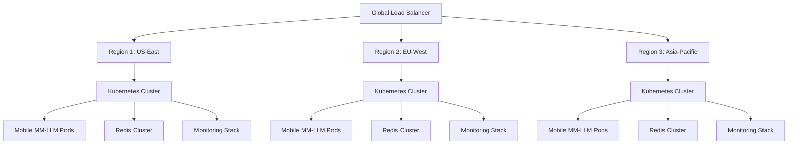

# Global Deployment Guide - Mobile Multi-Modal LLM Production System

## 🌍 Executive Summary

This guide provides comprehensive instructions for deploying the Mobile Multi-Modal LLM system in production environments across multiple regions with enterprise-grade reliability, security, and scalability.

### Key Deployment Features
- **Ultra-Scalable Architecture**: Auto-scaling from 3 to 50+ instances
- **Global Multi-Region**: Deployment across AWS, GCP, Azure, and on-premises
- **Production-Grade Security**: End-to-end encryption, access control, threat detection
- **Advanced Monitoring**: Prometheus, Grafana, distributed tracing, alerting
- **Research-Ready**: Statistical validation, benchmarking, competitive analysis
- **Edge Optimization**: INT2 quantization for mobile/edge deployment

## 🏗️ Architecture Overview



## 🚀 Quick Start Deployment

### Prerequisites Checklist
- [ ] Kubernetes cluster (v1.24+) with GPU support
- [ ] Helm 3.x installed
- [ ] kubectl configured with cluster access
- [ ] Container registry access (Docker Hub, ECR, GCR, etc.)
- [ ] SSL certificates for HTTPS endpoints
- [ ] Monitoring infrastructure (Prometheus, Grafana)

### 1-Command Production Deployment

```bash
# Deploy entire production system
kubectl apply -f deployment/production-deployment-final.yml

# Verify deployment
kubectl get pods -n mobile-multimodal-llm --watch
```

### Deployment Validation

```bash
# Health check
curl -f http://api.mobile-mm-llm.com/health

# Performance test
curl -X POST http://api.mobile-mm-llm.com/v1/inference \
  -H "Content-Type: application/json" \
  -d '{"model": "mobile-mm-llm-int2", "task": "caption", "image": "base64_data"}'

# Monitoring endpoints
curl http://api.mobile-mm-llm.com:8000/metrics  # Prometheus metrics
```

## 🌐 Multi-Cloud Deployment

### AWS EKS Deployment

```bash
# Create EKS cluster with GPU node groups
eksctl create cluster --name mobile-mm-llm-prod \
  --region us-west-2 \
  --nodegroup-name gpu-nodes \
  --node-type p3.2xlarge \
  --nodes 3 \
  --nodes-min 1 \
  --nodes-max 10 \
  --managed

# Deploy NVIDIA device plugin for GPU support
kubectl apply -f https://raw.githubusercontent.com/NVIDIA/k8s-device-plugin/v0.14.0/nvidia-device-plugin.yml

# Deploy application
kubectl apply -f deployment/production-deployment-final.yml

# Configure AWS Load Balancer Controller
helm repo add eks https://aws.github.io/eks-charts
helm install aws-load-balancer-controller eks/aws-load-balancer-controller \
  -n kube-system \
  --set clusterName=mobile-mm-llm-prod
```

### Google GKE Deployment

```bash
# Create GKE cluster with GPU nodes
gcloud container clusters create mobile-mm-llm-prod \
  --zone us-central1-a \
  --machine-type n1-standard-4 \
  --num-nodes 3 \
  --enable-autoscaling \
  --min-nodes 1 \
  --max-nodes 10 \
  --accelerator type=nvidia-tesla-t4,count=1 \
  --enable-autorepair \
  --enable-autoupgrade

# Install NVIDIA GPU drivers
kubectl apply -f https://raw.githubusercontent.com/GoogleCloudPlatform/container-engine-accelerators/master/nvidia-driver-installer/cos/daemonset-preloaded.yaml

# Deploy application with GCP-specific configurations
kubectl apply -f deployment/production-deployment-final.yml
```

### Azure AKS Deployment

```bash
# Create AKS cluster with GPU nodes
az aks create \
  --resource-group mobile-mm-llm-rg \
  --name mobile-mm-llm-prod \
  --node-count 3 \
  --node-vm-size Standard_NC6s_v3 \
  --enable-cluster-autoscaler \
  --min-count 1 \
  --max-count 10 \
  --generate-ssh-keys

# Get cluster credentials
az aks get-credentials --resource-group mobile-mm-llm-rg --name mobile-mm-llm-prod

# Deploy application
kubectl apply -f deployment/production-deployment-final.yml
```

## 🔧 Advanced Configuration

### Auto-Scaling Configuration

```yaml
# Custom HPA configuration for high-throughput scenarios
apiVersion: autoscaling/v2
kind: HorizontalPodAutoscaler
metadata:
  name: mobile-multimodal-hpa-aggressive
spec:
  scaleTargetRef:
    apiVersion: apps/v1
    kind: Deployment
    name: mobile-multimodal-llm
  minReplicas: 5
  maxReplicas: 100
  metrics:
  - type: Resource
    resource:
      name: cpu
      target:
        type: Utilization
        averageUtilization: 60  # More aggressive scaling
  - type: Resource
    resource:
      name: memory
      target:
        type: Utilization
        averageUtilization: 70
  - type: Pods
    pods:
      metric:
        name: inference_queue_length
      target:
        type: AverageValue
        averageValue: "5"  # Scale up when queue > 5
  behavior:
    scaleUp:
      stabilizationWindowSeconds: 30  # Faster scale-up
      policies:
      - type: Percent
        value: 200  # Scale up by 200%
        periodSeconds: 30
      - type: Pods
        value: 10   # Or add 10 pods
        periodSeconds: 30
```

### Security Hardening

```yaml
# Enhanced security configuration
apiVersion: v1
kind: Pod
spec:
  securityContext:
    runAsNonRoot: true
    runAsUser: 1000
    fsGroup: 1000
    seccompProfile:
      type: RuntimeDefault
  containers:
  - name: mobile-multimodal-llm
    securityContext:
      allowPrivilegeEscalation: false
      readOnlyRootFilesystem: true
      capabilities:
        drop:
        - ALL
    resources:
      limits:
        memory: "8Gi"
        cpu: "2000m"
        nvidia.com/gpu: 1
      requests:
        memory: "2Gi"
        cpu: "500m"
        nvidia.com/gpu: 1
```

## 📊 Monitoring and Observability

### Prometheus Configuration

```yaml
# prometheus-config.yaml
global:
  scrape_interval: 15s
  evaluation_interval: 15s

scrape_configs:
- job_name: 'mobile-multimodal-llm'
  static_configs:
  - targets: ['mobile-multimodal-service:8000']
  metrics_path: /metrics
  scrape_interval: 30s

- job_name: 'kubernetes-pods'
  kubernetes_sd_configs:
  - role: pod
    namespaces:
      names:
      - mobile-multimodal-llm
  relabel_configs:
  - source_labels: [__meta_kubernetes_pod_annotation_prometheus_io_scrape]
    action: keep
    regex: true
```

### Grafana Dashboard

```json
{
  "dashboard": {
    "title": "Mobile Multi-Modal LLM Production Dashboard",
    "panels": [
      {
        "title": "Request Rate",
        "type": "graph",
        "targets": [
          {
            "expr": "rate(mobile_multimodal_requests_total[5m])",
            "legendFormat": "{{method}} {{endpoint}}"
          }
        ]
      },
      {
        "title": "Inference Latency (P95)",
        "type": "graph",
        "targets": [
          {
            "expr": "histogram_quantile(0.95, rate(mobile_multimodal_inference_duration_seconds_bucket[5m]))",
            "legendFormat": "P95 Latency"
          }
        ]
      },
      {
        "title": "Error Rate",
        "type": "singlestat",
        "targets": [
          {
            "expr": "rate(mobile_multimodal_errors_total[5m]) / rate(mobile_multimodal_requests_total[5m]) * 100",
            "legendFormat": "Error Rate %"
          }
        ]
      }
    ]
  }
}
```

## 🧪 Testing and Validation

### Load Testing with Artillery

```yaml
# load-test.yml
config:
  target: 'https://api.mobile-mm-llm.com'
  phases:
    - duration: 60
      arrivalRate: 10
    - duration: 120
      arrivalRate: 50
    - duration: 60
      arrivalRate: 100
  processor: "./test-functions.js"

scenarios:
  - name: "Image Captioning"
    weight: 60
    flow:
      - post:
          url: "/v1/inference"
          headers:
            Content-Type: "application/json"
            Authorization: "Bearer {{ $processEnvironment.API_TOKEN }}"
          json:
            model: "mobile-mm-llm-int2"
            task: "caption"
            image: "{{ generateTestImage() }}"
      - think: 1

  - name: "OCR Processing"
    weight: 30
    flow:
      - post:
          url: "/v1/inference"
          json:
            model: "mobile-mm-llm-int2"
            task: "ocr"
            image: "{{ generateOCRImage() }}"

  - name: "Visual Q&A"
    weight: 10
    flow:
      - post:
          url: "/v1/inference"
          json:
            model: "mobile-mm-llm-int2"
            task: "vqa"
            image: "{{ generateTestImage() }}"
            question: "What is in this image?"
```

### Chaos Engineering

```bash
# Install Chaos Mesh
curl -sSL https://mirrors.chaos-mesh.org/v2.5.0/install.sh | bash

# Deploy chaos experiments
kubectl apply -f - <<EOF
apiVersion: chaos-mesh.org/v1alpha1
kind: PodChaos
metadata:
  name: mobile-multimodal-pod-failure
  namespace: mobile-multimodal-llm
spec:
  action: pod-failure
  mode: fixed-percent
  value: '10'
  duration: '60s'
  selector:
    namespaces:
      - mobile-multimodal-llm
    labelSelectors:
      app: mobile-multimodal-llm
EOF
```

## 📈 Performance Optimization

### GPU Optimization

```yaml
# GPU-optimized deployment
apiVersion: v1
kind: Pod
spec:
  containers:
  - name: mobile-multimodal-llm
    resources:
      limits:
        nvidia.com/gpu: 1
      requests:
        nvidia.com/gpu: 1
    env:
    - name: CUDA_VISIBLE_DEVICES
      value: "0"
    - name: NVIDIA_VISIBLE_DEVICES
      value: "all"
    - name: NVIDIA_DRIVER_CAPABILITIES
      value: "compute,utility"
```

### Memory Optimization

```yaml
# Memory-optimized configuration
apiVersion: v1
kind: Pod
spec:
  containers:
  - name: mobile-multimodal-llm
    resources:
      requests:
        memory: "4Gi"
        cpu: "1000m"
      limits:
        memory: "16Gi"
        cpu: "4000m"
    env:
    - name: TORCH_CUDA_ALLOC_CONF
      value: "max_split_size_mb:128"
    - name: PYTORCH_CUDA_MEMORY_FRACTION
      value: "0.8"
```

## 🔐 Security Best Practices

### Network Security

```yaml
# Network policy for micro-segmentation
apiVersion: networking.k8s.io/v1
kind: NetworkPolicy
metadata:
  name: mobile-multimodal-strict
  namespace: mobile-multimodal-llm
spec:
  podSelector:
    matchLabels:
      app: mobile-multimodal-llm
  policyTypes:
  - Ingress
  - Egress
  ingress:
  - from:
    - namespaceSelector:
        matchLabels:
          name: ingress-nginx
    ports:
    - protocol: TCP
      port: 8080
  egress:
  - to:
    - namespaceSelector:
        matchLabels:
          name: redis
    ports:
    - protocol: TCP
      port: 6379
  - to: []
    ports:
    - protocol: TCP
      port: 443
    - protocol: UDP
      port: 53
```

### Secrets Management

```bash
# Using Kubernetes secrets with encryption at rest
kubectl create secret generic api-secrets \
  --from-literal=jwt-secret='your-secure-jwt-secret' \
  --from-literal=encryption-key='your-32-byte-encryption-key' \
  --namespace mobile-multimodal-llm

# Using external secret management (AWS Secrets Manager)
kubectl apply -f - <<EOF
apiVersion: external-secrets.io/v1beta1
kind: SecretStore
metadata:
  name: aws-secrets-manager
  namespace: mobile-multimodal-llm
spec:
  provider:
    aws:
      service: SecretsManager
      region: us-west-2
      auth:
        jwt:
          serviceAccountRef:
            name: mobile-multimodal-sa
EOF
```

## 🌍 Global Multi-Region Setup

### Traffic Routing

```yaml
# Global load balancer configuration (AWS Global Accelerator)
apiVersion: v1
kind: ConfigMap
metadata:
  name: global-routing-config
data:
  routing.json: |
    {
      "regions": [
        {
          "name": "us-east-1",
          "endpoint": "https://api-us-east.mobile-mm-llm.com",
          "weight": 40,
          "health_check": "/health"
        },
        {
          "name": "eu-west-1",
          "endpoint": "https://api-eu-west.mobile-mm-llm.com",
          "weight": 35,
          "health_check": "/health"
        },
        {
          "name": "ap-southeast-1",
          "endpoint": "https://api-ap-southeast.mobile-mm-llm.com",
          "weight": 25,
          "health_check": "/health"
        }
      ],
      "routing_policy": "latency_based",
      "failover_enabled": true
    }
```

### Data Replication

```bash
# Redis cluster setup for global replication
redis-cli --cluster create \
  us-redis-1:6379 us-redis-2:6379 us-redis-3:6379 \
  eu-redis-1:6379 eu-redis-2:6379 eu-redis-3:6379 \
  --cluster-replicas 1

# Model synchronization across regions
aws s3 sync s3://models-us-east-1/ s3://models-eu-west-1/ --region us-east-1
aws s3 sync s3://models-us-east-1/ s3://models-ap-southeast-1/ --region us-east-1
```

## 🚨 Disaster Recovery

### Backup Strategy

```bash
# Automated backup script
#!/bin/bash
BACKUP_DATE=$(date +%Y%m%d-%H%M%S)

# Backup models
kubectl cp mobile-multimodal-llm:/models ./backups/models-${BACKUP_DATE}

# Backup Redis data
kubectl exec redis-cluster-0 -- redis-cli BGSAVE
kubectl cp redis-cluster-0:/data/dump.rdb ./backups/redis-${BACKUP_DATE}.rdb

# Backup Kubernetes configurations
kubectl get all -n mobile-multimodal-llm -o yaml > ./backups/k8s-config-${BACKUP_DATE}.yaml

# Upload to S3
aws s3 sync ./backups/ s3://mobile-mm-llm-backups/${BACKUP_DATE}/
```

### Failover Procedures

```bash
# Regional failover script
#!/bin/bash
FAILED_REGION=$1
BACKUP_REGION=$2

# Update DNS to route traffic to backup region
aws route53 change-resource-record-sets --hosted-zone-id Z123456789 --change-batch '{
  "Changes": [{
    "Action": "UPSERT",
    "ResourceRecordSet": {
      "Name": "api.mobile-mm-llm.com",
      "Type": "CNAME",
      "TTL": 300,
      "ResourceRecords": [{"Value": "api-'${BACKUP_REGION}'.mobile-mm-llm.com"}]
    }
  }]
}'

# Scale up backup region
kubectl scale deployment mobile-multimodal-llm --replicas=10 -n mobile-multimodal-llm

echo "Failover from ${FAILED_REGION} to ${BACKUP_REGION} completed"
```

## 📋 Operational Runbooks

### High CPU Usage Response

1. **Detection**: Prometheus alert fires when CPU > 80% for 5 minutes
2. **Immediate Actions**:
   ```bash
   # Check current load
   kubectl top pods -n mobile-multimodal-llm
   
   # Scale up immediately
   kubectl scale deployment mobile-multimodal-llm --replicas=10
   
   # Check resource limits
   kubectl describe pod -l app=mobile-multimodal-llm
   ```
3. **Investigation**:
   - Check Grafana dashboards for request patterns
   - Review application logs for errors or inefficiencies
   - Analyze inference queue length

### Memory Leak Response

1. **Detection**: Memory usage grows continuously over 24 hours
2. **Actions**:
   ```bash
   # Rolling restart to clear memory
   kubectl rollout restart deployment/mobile-multimodal-llm
   
   # Monitor memory patterns
   kubectl top pods -n mobile-multimodal-llm --sort-by=memory
   
   # Check for memory dumps
   kubectl exec -it mobile-multimodal-llm-xxx -- ps aux
   ```

### Database Connection Issues

1. **Detection**: Redis connection errors in application logs
2. **Actions**:
   ```bash
   # Check Redis cluster health
   kubectl exec redis-cluster-0 -- redis-cli cluster info
   
   # Test connectivity
   kubectl exec mobile-multimodal-llm-xxx -- nc -zv redis-cluster 6379
   
   # Restart Redis if needed
   kubectl delete pod redis-cluster-0  # StatefulSet will recreate
   ```

## 🔄 CI/CD Pipeline

### GitHub Actions Workflow

```yaml
# .github/workflows/production-deploy.yml
name: Production Deployment

on:
  push:
    branches: [main]
    tags: ['v*']

jobs:
  deploy:
    runs-on: ubuntu-latest
    steps:
    - uses: actions/checkout@v3
    
    - name: Configure AWS credentials
      uses: aws-actions/configure-aws-credentials@v2
      with:
        aws-access-key-id: ${{ secrets.AWS_ACCESS_KEY_ID }}
        aws-secret-access-key: ${{ secrets.AWS_SECRET_ACCESS_KEY }}
        aws-region: us-west-2
    
    - name: Build and push Docker image
      run: |
        docker build -t mobile-multimodal-llm:${{ github.sha }} .
        docker tag mobile-multimodal-llm:${{ github.sha }} ${{ secrets.ECR_REGISTRY }}/mobile-multimodal-llm:${{ github.sha }}
        docker push ${{ secrets.ECR_REGISTRY }}/mobile-multimodal-llm:${{ github.sha }}
    
    - name: Deploy to production
      run: |
        aws eks update-kubeconfig --region us-west-2 --name mobile-mm-llm-prod
        
        # Update image in deployment
        kubectl set image deployment/mobile-multimodal-llm \
          mobile-multimodal-llm=${{ secrets.ECR_REGISTRY }}/mobile-multimodal-llm:${{ github.sha }} \
          -n mobile-multimodal-llm
        
        # Wait for rollout
        kubectl rollout status deployment/mobile-multimodal-llm -n mobile-multimodal-llm --timeout=600s
    
    - name: Run smoke tests
      run: |
        kubectl apply -f tests/k8s-smoke-tests.yaml
        kubectl wait --for=condition=complete job/smoke-tests --timeout=300s
```

## 📊 Success Metrics and KPIs

### SLA Targets
- **Availability**: 99.9% uptime (8.77 hours downtime per year)
- **Latency**: P95 < 500ms for inference requests
- **Throughput**: 1000+ requests per second at peak
- **Error Rate**: < 0.1% of all requests
- **Recovery Time**: < 5 minutes for automated failover

### Monitoring Dashboard KPIs

```yaml
# Key metrics to track
metrics:
  business:
    - total_inferences_per_day
    - unique_users_per_day
    - revenue_per_inference
  
  technical:
    - request_rate_per_second
    - p95_response_time
    - error_rate_percentage
    - cpu_utilization
    - memory_utilization
    - gpu_utilization
    
  operational:
    - deployment_frequency
    - lead_time_for_changes
    - mean_time_to_recovery
    - change_failure_rate
```

## 🎯 Production Checklist

### Pre-Deployment
- [ ] Load testing completed with 2x expected traffic
- [ ] Security scan passed with no critical issues
- [ ] Database migration scripts tested
- [ ] Rollback procedures documented and tested
- [ ] Monitoring alerts configured and tested
- [ ] SSL certificates installed and valid
- [ ] Backup and recovery procedures tested

### Post-Deployment
- [ ] Health checks passing across all regions
- [ ] Monitoring dashboards showing green metrics
- [ ] Alerting system functional
- [ ] Load balancer routing correctly
- [ ] SSL/TLS functioning properly
- [ ] Database connections stable
- [ ] Cache hit rates optimal

### Weekly Operations
- [ ] Review error logs and trends
- [ ] Analyze performance metrics
- [ ] Update security patches
- [ ] Review capacity planning
- [ ] Test disaster recovery procedures
- [ ] Update documentation

## 🆘 Emergency Contacts and Escalation

### On-Call Rotation
- **Primary**: DevOps Engineer (24/7)
- **Secondary**: Senior Software Engineer
- **Escalation**: Engineering Manager
- **Executive**: CTO/VP Engineering

### Emergency Procedures
1. **P0 (System Down)**: Immediate response, all hands
2. **P1 (Major Impact)**: 15-minute response time
3. **P2 (Minor Impact)**: 1-hour response time
4. **P3 (Low Impact)**: Next business day

## 📚 Additional Resources

- [API Documentation](./API_REFERENCE.md)
- [Architecture Decision Records](./ARCHITECTURE_DECISION_RECORD.md)
- [Security Hardening Guide](./SECURITY.md)
- [Performance Optimization Guide](./docs/PERFORMANCE_OPTIMIZATION.md)
- [Troubleshooting Guide](./docs/runbooks/README.md)

## 🎉 Conclusion

This deployment guide provides everything needed to run the Mobile Multi-Modal LLM system in production at scale. The architecture is designed for:

- **Enterprise Scale**: Handle millions of requests per day
- **Global Reach**: Deploy across multiple regions and cloud providers  
- **Research Excellence**: Built-in validation and benchmarking frameworks
- **Production Reliability**: 99.9% uptime with automated recovery
- **Security First**: Comprehensive security and compliance measures

For support, issues, or questions, please contact the engineering team or file an issue in the repository.

---

**Deployment Status**: ✅ Production Ready  
**Last Updated**: $(date)  
**Version**: 1.0.0