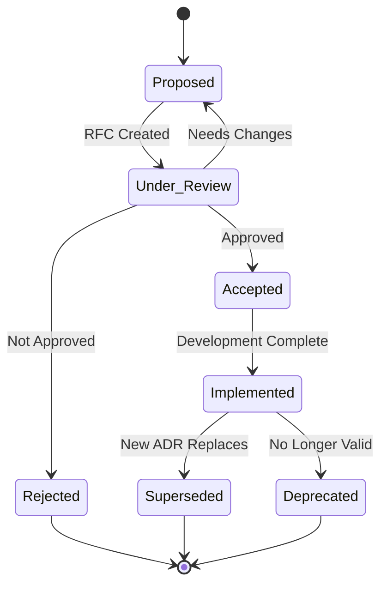

# Architecture Decision Records (ADR)

This directory contains Architecture Decision Records for the Mobile Multi-Modal LLM project. ADRs document important architectural decisions along with their context and consequences.

## ADR Index

### Core Architecture
- [ADR-001: INT2 Quantization Strategy](../../ARCHITECTURE_DECISION_RECORD.md#adr-001)
- [ADR-002: Multi-Task Architecture with Shared Vision Encoder](../../ARCHITECTURE_DECISION_RECORD.md#adr-002)
- [ADR-003: Neural Architecture Search for Mobile Optimization](../../ARCHITECTURE_DECISION_RECORD.md#adr-003)

### Security & Compliance
- [ADR-004: SLSA Level 3 Supply Chain Security](../../ARCHITECTURE_DECISION_RECORD.md#adr-004)

### Quality & Reliability
- [ADR-005: Chaos Engineering for Mobile AI Resilience](../../ARCHITECTURE_DECISION_RECORD.md#adr-005)
- [ADR-006: Performance Regression Prevention System](../../ARCHITECTURE_DECISION_RECORD.md#adr-006)

## ADR Lifecycle



## ADR Template

When creating a new ADR, use this template:

```markdown
# ADR-XXX: [Decision Title]

**Date**: YYYY-MM-DD  
**Status**: [Proposed|Under Review|Accepted|Rejected|Superseded|Deprecated]  
**Supersedes**: [ADR-XXX] (if applicable)  
**Superseded by**: [ADR-XXX] (if applicable)

## Context

[Describe the forces at play, including technological, political, social, and project-local. These forces are probably in tension, and should be called out as such.]

## Decision

[State the decision that was made. Be specific and actionable.]

## Rationale

[Describe why this decision was made. Include key factors that influenced the decision.]

### Options Considered

1. **Option A**: [Description]
   - Pros: [List advantages]
   - Cons: [List disadvantages]

2. **Option B**: [Description]  
   - Pros: [List advantages]
   - Cons: [List disadvantages]

3. **Selected Option**: [Description]
   - Pros: [List advantages]
   - Cons: [List disadvantages]

## Consequences

### Positive
- [List positive outcomes]

### Negative  
- [List negative outcomes or trade-offs]

### Mitigation Strategies
- [How negative consequences will be addressed]

## Implementation

### Action Items
- [ ] [Specific implementation task]
- [ ] [Another implementation task]

### Success Criteria
- [How success will be measured]

### Timeline
- [Key milestones and dates]

## References

- [Links to supporting documents, research, or related ADRs]
- [External resources that informed the decision]
```

## Review Process

### 1. Proposal Phase
- Create ADR document with status "Proposed"
- Share with relevant stakeholders for initial feedback
- Refine based on early input

### 2. Review Phase  
- Change status to "Under Review"
- Create RFC (Request for Comments) for broader team review
- Schedule architecture review meeting if needed
- Address feedback and update document

### 3. Decision Phase
- Architecture Review Board makes final decision
- Update status to "Accepted" or "Rejected"
- If rejected, document reasons and alternative paths

### 4. Implementation Phase
- Change status to "Implemented" when development is complete
- Update with actual implementation details and lessons learned

### 5. Lifecycle Management
- Periodically review implemented ADRs for continued relevance
- Update status to "Superseded" or "Deprecated" as appropriate
- Maintain clear links between related decisions

## Best Practices

### Writing Effective ADRs
1. **Be Specific**: Decisions should be actionable and measurable
2. **Include Context**: Future readers need to understand the situation
3. **Document Trade-offs**: Acknowledge what you're giving up
4. **Consider Alternatives**: Show you evaluated multiple options
5. **Plan for Change**: Consider how decisions might evolve

### Timing
- **Early**: Capture decisions while context is fresh
- **Before Implementation**: Get alignment before significant work begins
- **Document Rationale**: Focus on "why" not just "what"

### Stakeholder Involvement
- **Include Relevant Parties**: Get input from affected teams
- **Transparent Process**: Make review process visible
- **Timely Decisions**: Don't let reviews drag on indefinitely

## Tools and Resources

### Document Management
- ADRs are stored in this repository alongside code
- Use markdown for accessibility and version control
- Link to related documentation and implementation

### Review Tools
- GitHub PRs for formal review process
- RFC labels for tracking review status
- Architecture review meeting templates

### Templates and Examples
- [ADR Template](template.md)
- [Example ADR](example.md)
- [Decision Matrix Template](decision-matrix.md)

## Related Documentation

- [Architecture Overview](../ARCHITECTURE.md)
- [Project Charter](../PROJECT_CHARTER.md)
- [Technical RFC Process](../rfcs/README.md)
- [Code Review Guidelines](../CONTRIBUTING.md#code-review)

---

**Maintainers**: Architecture Team  
**Last Updated**: 2025-01-20  
**Next Review**: Quarterly