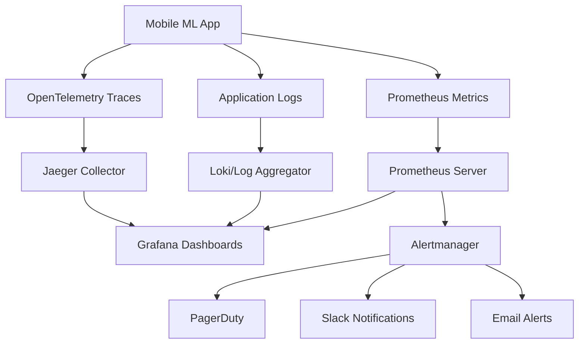

# Mobile Multi-Modal LLM Monitoring Guide

This document provides comprehensive guidance for monitoring, observability, and performance tracking of the Mobile Multi-Modal LLM system.

## Overview

Our monitoring stack includes:
- **Metrics**: Prometheus + Grafana for time-series data
- **Logging**: Structured JSON logging with rotation
- **Tracing**: OpenTelemetry + Jaeger for distributed tracing
- **Alerting**: Prometheus Alertmanager with multiple notification channels
- **Health Checks**: Comprehensive endpoint monitoring
- **Performance Monitoring**: APM and profiling integration

## Quick Start

### 1. Start Monitoring Stack

```bash
# Start all monitoring services
docker-compose --profile monitoring up -d

# Or start specific services
docker-compose up -d prometheus grafana
```

### 2. Access Dashboards

- **Grafana**: http://localhost:3000 (admin/admin123)
- **Prometheus**: http://localhost:9090
- **Jaeger**: http://localhost:16686

### 3. View Application Metrics

```bash
# Check application metrics endpoint
curl http://localhost:8080/metrics

# View health status
curl http://localhost:8080/health
```

## Architecture

### Monitoring Data Flow



### Component Responsibilities

| Component | Purpose | Port | Configuration |
|-----------|---------|------|---------------|
| Prometheus | Metrics collection and storage | 9090 | `monitoring/prometheus.yml` |
| Grafana | Visualization and dashboards | 3000 | `monitoring/grafana/` |
| Jaeger | Distributed tracing | 16686 | Environment variables |
| Alertmanager | Alert routing and notifications | 9093 | `monitoring/alerts.yml` |
| Application | Metrics/logs/traces generation | 8080 | `monitoring/observability.yml` |

## Metrics Reference

### Core Application Metrics

#### Performance Metrics
```prometheus
# Inference latency (histogram)
model_inference_duration_seconds{model_type="multimodal", task="captioning", quantization="int2"}

# Request rate (counter)
model_inference_requests_total{model_type="multimodal", task="captioning", status="success"}

# Memory usage (gauge)
model_memory_usage_bytes{model_type="multimodal", component="encoder"}

# Model loading time (gauge)
model_load_duration_seconds{model_type="multimodal", quantization="int2"}
```

#### Mobile-Specific Metrics
```prometheus
# Mobile export duration
mobile_export_duration_seconds{platform="android", quantization="int2"}

# Exported model size
mobile_export_size_bytes{platform="ios", quantization="int2"}

# Quantization accuracy loss
quantization_accuracy_loss{quantization_type="int2", task="captioning"}
```

#### System Metrics
```prometheus
# GPU memory usage
gpu_memory_usage_bytes{gpu_id="0", memory_type="allocated"}

# Batch processing time
batch_processing_duration_seconds{batch_size="32", task="training"}
```

### Business Metrics

#### Usage Metrics
```prometheus
# API usage per user
api_requests_per_user{user_id="user123", endpoint="/inference"}

# Task popularity
model_usage_by_task{task="captioning", user_type="free"}

# Error rates
error_rate_by_endpoint{endpoint="/inference", error_type="timeout"}
```

## Dashboards

### Available Dashboards

1. **Mobile Multi-Modal Overview**
   - System health overview
   - Key performance indicators
   - Error rates and response times
   - Resource utilization

2. **Model Performance**
   - Inference latency percentiles
   - Accuracy metrics over time
   - Memory usage patterns
   - Quantization impact analysis

3. **Infrastructure Monitoring**
   - Server resource usage
   - Database performance
   - Network metrics
   - Container health

4. **Mobile Export Monitoring**
   - Export success rates
   - Model size trends
   - Platform-specific metrics
   - Performance comparisons

### Creating Custom Dashboards

1. **Access Grafana**: http://localhost:3000
2. **Import Dashboard**: Use dashboard ID or JSON file
3. **Configure Data Sources**: Prometheus, Jaeger, Loki
4. **Set Variables**: Environment, model type, instance
5. **Save Dashboard**: Export JSON for version control

### Dashboard Best Practices

- **Use Templating**: Variables for environment, service, instance
- **Consistent Time Ranges**: Standardize on common time windows
- **Alert Annotations**: Show alert boundaries on graphs
- **Meaningful Titles**: Clear, descriptive panel titles
- **Color Coding**: Consistent colors for similar metrics

## Alerting

### Alert Categories

#### Critical Alerts (PagerDuty)
- Service completely down
- Inference latency > 1 second
- Error rate > 50%
- GPU out of memory
- Model loading failures

#### Warning Alerts (Slack)
- Inference latency > 100ms
- Error rate > 10%
- Memory usage > 80%
- Disk space < 20%
- Quantization accuracy loss > 5%

#### Info Alerts (Email)
- New model deployments
- Configuration changes
- Performance degradation trends
- Capacity planning alerts

### Alert Configuration

#### Prometheus Alert Rules

```yaml
# High inference latency
- alert: HighInferenceLatency
  expr: histogram_quantile(0.95, model_inference_duration_seconds) > 0.1
  for: 5m
  labels:
    severity: warning
  annotations:
    description: "95th percentile inference latency is {{ $value }}s"

# Model loading failure
- alert: ModelLoadingFailure
  expr: increase(model_load_failures_total[5m]) > 0
  for: 0m
  labels:
    severity: critical
  annotations:
    description: "Model loading failed {{ $value }} times in the last 5 minutes"
```

#### Alertmanager Routing

```yaml
route:
  group_by: ['alertname']
  group_wait: 10s
  group_interval: 10s
  repeat_interval: 1h
  receiver: 'web.hook'
  routes:
  - match:
      severity: critical
    receiver: pagerduty-critical
  - match:
      severity: warning
    receiver: slack-warnings
```

## Logging

### Log Levels and Usage

| Level | Usage | Examples |
|-------|-------|----------|
| ERROR | System errors, failures | Model loading failed, out of memory |
| WARN | Recoverable issues | High latency, retries, degraded performance |
| INFO | Normal operations | Request started/completed, model loaded |
| DEBUG | Detailed debugging | Parameter values, intermediate results |

### Structured Logging Format

```json
{
  "timestamp": "2025-01-20T10:30:00Z",
  "level": "INFO",
  "service": "mobile-multimodal-llm",
  "version": "0.1.0",
  "instance_id": "pod-123",
  "trace_id": "abc123",
  "span_id": "def456",
  "message": "Model inference completed",
  "duration_ms": 45,
  "model_type": "multimodal",
  "task": "captioning",
  "batch_size": 1,
  "memory_mb": 256
}
```

### Log Aggregation

#### Viewing Logs

```bash
# View application logs
docker-compose logs -f app-prod

# Search logs with specific criteria
docker-compose exec app-prod grep "ERROR" /app/logs/application.log

# View real-time logs in Grafana
# Navigate to Explore > Loki > {service="mobile-multimodal-llm"}
```

#### Log Queries (Loki)

```logql
# All errors in the last hour
{service="mobile-multimodal-llm"} |= "ERROR"

# Inference logs with high latency
{service="mobile-multimodal-llm"} | json | duration_ms > 100

# Mobile export logs
{service="mobile-multimodal-llm"} | json | operation="mobile_export"
```

## Tracing

### Distributed Tracing Overview

Our tracing implementation captures:
- **Request Flow**: End-to-end request processing
- **Model Operations**: Loading, inference, export
- **Database Queries**: Performance and errors
- **External Calls**: API dependencies
- **Mobile Exports**: Cross-platform build processes

### Key Trace Operations

#### Model Inference Trace
```
Request → Authentication → Model Loading → Preprocessing → 
Inference → Postprocessing → Response
```

#### Mobile Export Trace
```
Export Request → Model Validation → Platform Selection → 
Quantization → Export → Validation → Storage
```

### Viewing Traces

1. **Access Jaeger**: http://localhost:16686
2. **Select Service**: mobile-multimodal-llm
3. **Choose Operation**: model_inference, mobile_export
4. **Filter by Tags**: model_type, quantization, platform
5. **Analyze Performance**: Identify bottlenecks

### Custom Instrumentation

```python
from opentelemetry import trace

tracer = trace.get_tracer(__name__)

@tracer.start_as_current_span("model_inference")
def run_inference(model, input_data):
    span = trace.get_current_span()
    span.set_attribute("model.type", model.type)
    span.set_attribute("input.size", len(input_data))
    
    # Perform inference
    result = model.forward(input_data)
    
    span.set_attribute("output.size", len(result))
    return result
```

## Health Checks

### Health Endpoints

| Endpoint | Purpose | Frequency | Timeout |
|----------|---------|-----------|---------|
| `/alive` | Basic liveness check | 10s | 5s |
| `/ready` | Readiness for traffic | 15s | 10s |
| `/health` | Comprehensive health | 30s | 15s |
| `/model/health` | Model-specific health | 60s | 30s |

### Health Check Responses

#### Healthy Response
```json
{
  "status": "healthy",
  "timestamp": "2025-01-20T10:30:00Z",
  "version": "0.1.0",
  "uptime_seconds": 3600,
  "checks": {
    "database": "healthy",
    "model": "healthy",
    "memory": "healthy",
    "disk": "healthy"
  }
}
```

#### Unhealthy Response
```json
{
  "status": "unhealthy",
  "timestamp": "2025-01-20T10:30:00Z",
  "version": "0.1.0",
  "uptime_seconds": 3600,
  "checks": {
    "database": "healthy",
    "model": "unhealthy",
    "memory": "healthy",
    "disk": "healthy"
  },
  "errors": [
    {
      "component": "model",
      "message": "Model failed to load",
      "code": "MODEL_LOAD_FAILED"
    }
  ]
}
```

## Performance Monitoring

### Application Performance Monitoring (APM)

#### Transaction Monitoring
- **Model Inference**: Target < 100ms, Alert > 500ms
- **Model Loading**: Target < 10s, Alert > 30s
- **Mobile Export**: Target < 1min, Alert > 5min

#### Resource Monitoring
- **CPU Usage**: Target < 70%, Alert > 90%
- **Memory Usage**: Target < 80%, Alert > 95%
- **GPU Memory**: Target < 80%, Alert > 95%
- **Disk Usage**: Target < 80%, Alert > 90%

### Profiling

#### CPU Profiling
```bash
# Enable CPU profiling
export ENABLE_PROFILING=true
export CPU_PROFILE_DURATION=30
export CPU_PROFILE_INTERVAL=3600

# View CPU profiles
docker-compose exec app-prod ls /app/profiles/cpu/
```

#### Memory Profiling
```bash
# Enable memory profiling
export MEMORY_PROFILE_DURATION=60
export MEMORY_PROFILE_INTERVAL=1800

# View memory profiles
docker-compose exec app-prod ls /app/profiles/memory/
```

#### GPU Profiling
```bash
# GPU profiling (NVIDIA)
nvidia-smi --query-gpu=utilization.gpu,memory.used --format=csv --loop=1

# View GPU profiles
docker-compose exec app-gpu ls /app/profiles/gpu/
```

## Troubleshooting

### Common Issues

#### High Memory Usage
1. **Check Memory Metrics**: `model_memory_usage_bytes`
2. **Review Model Loading**: Check for memory leaks
3. **Analyze Traces**: Look for memory allocation patterns
4. **Scale Resources**: Increase memory limits

#### Slow Inference
1. **Check Latency Metrics**: `model_inference_duration_seconds`
2. **Review GPU Utilization**: `gpu_memory_usage_bytes`
3. **Analyze Batch Sizes**: Optimize for hardware
4. **Check Quantization**: Verify INT2 is working

#### Mobile Export Failures
1. **Check Export Logs**: Filter by `operation="mobile_export"`
2. **Review Platform Metrics**: `mobile_export_duration_seconds`
3. **Validate SDKs**: Ensure mobile SDKs are available
4. **Check Disk Space**: Export process requires temporary space

### Debug Commands

```bash
# Check service health
curl http://localhost:8080/health

# View metrics
curl http://localhost:8080/metrics | grep model_

# Check container logs
docker-compose logs app-prod | tail -100

# Monitor resource usage
docker stats mobile-multimodal-prod

# Test inference endpoint
curl -X POST http://localhost:8080/inference \
  -H "Content-Type: application/json" \
  -d '{"image": "base64_image_data", "task": "captioning"}'
```

### Performance Optimization

#### Model Optimization
- Enable INT2 quantization for mobile deployment
- Use batch processing for multiple requests
- Implement model caching for repeated loads
- Monitor accuracy vs. performance trade-offs

#### Infrastructure Optimization
- Scale based on request volume metrics
- Use GPU acceleration when available
- Implement connection pooling for databases
- Enable compression for network traffic

## Security Monitoring

### Security Events

Our monitoring tracks:
- **Authentication Failures**: Failed login attempts
- **Unauthorized Access**: Access to protected resources
- **Anomalous Requests**: Unusual request patterns
- **Model Tampering**: Unexpected model file changes
- **Configuration Changes**: Security-relevant config updates

### Audit Logging

All security-relevant events are logged with:
- **User Identity**: Who performed the action
- **Timestamp**: When the action occurred
- **Action Details**: What was done
- **Resource**: What was affected
- **Result**: Success or failure
- **Source IP**: Where the request came from

### Compliance

Our monitoring supports:
- **SOC 2**: Comprehensive audit trails
- **GDPR**: Data access and retention logging
- **HIPAA**: Healthcare data handling (if applicable)
- **PCI DSS**: Payment data protection (if applicable)

## Maintenance

### Regular Tasks

#### Daily
- [ ] Review critical alerts
- [ ] Check system health dashboards
- [ ] Verify backup completion
- [ ] Monitor resource usage trends

#### Weekly
- [ ] Review performance trends
- [ ] Update alert thresholds
- [ ] Cleanup old logs and metrics
- [ ] Test alert notifications

#### Monthly
- [ ] Review dashboard effectiveness
- [ ] Update monitoring documentation
- [ ] Analyze cost optimization opportunities
- [ ] Plan capacity upgrades

### Configuration Management

#### Version Control
- All monitoring configurations in Git
- Infrastructure as Code (Terraform/Ansible)
- Automated deployment pipelines
- Configuration validation tests

#### Change Management
- Monitoring changes through pull requests
- Staging environment testing
- Gradual rollout procedures
- Rollback procedures documented

---

## Additional Resources

- [Prometheus Documentation](https://prometheus.io/docs/)
- [Grafana Documentation](https://grafana.com/docs/)
- [OpenTelemetry Documentation](https://opentelemetry.io/docs/)
- [Jaeger Documentation](https://www.jaegertracing.io/docs/)
- [Mobile ML Performance Guide](../PERFORMANCE_OPTIMIZATION.md)

**Last Updated**: 2025-01-20  
**Maintainers**: DevOps Team, Mobile AI Team